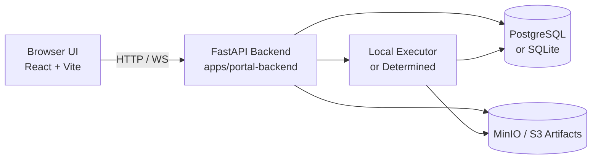

# RL Research Platform Architecture (One-Page)

## 1) Runtime Topology

## 2) Core Building Blocks

- Frontend (`/`, `/runs/:id`, matrix, opponent pools, replay gallery): React + Vite static bundle (`dist/`).
- Backend API (`/api/v1/*`): FastAPI service responsible for CRUD, scheduling, metrics, artifacts and replay metadata.
- Metadata store:
  - Production-like: PostgreSQL (`docker-compose.yml`).
  - Dev fallback: SQLite (`DATABASE_URL=sqlite:///...`).
- Artifact store:
  - MinIO in compose mode (`S3_ENDPOINT_URL=http://minio:9000`).
  - Local filesystem fallback (`.local/artifacts`).
- Execution layer:
  - `EXECUTOR_MODE=local` for local jobs.
  - Optional Determined integration via `docker-compose.determined.yml`.

## 3) End-to-End Demo Chain

1. Dashboard summarizes runs, environments and job status.
2. Open Run Detail for metrics curves, checkpoints and replay artifacts.
3. Replay Gallery renders adversarial rollouts and supports WebM export.
4. Matrix View shows cross-agent evaluation matrix.
5. Opponent Pools show candidate opponents and sampling sets.

## 4) Startup Paths

- Full stack compose: `docker compose up -d`
- Local backend + local frontend:
  1. `npm run build` (frontend bundle)
  2. `scripts/backend-local-up.sh` (FastAPI + DB init/seed)
- Health endpoint: `GET /healthz` (used by CI and acceptance smoke).

## 5) Reliability Guardrails

- `scripts/acceptance-check.sh` verifies:
  - compose file validity
  - frontend build
  - backend health startup
- CI (`.github/workflows/ci.yml`) runs the same critical checks on PR/push.
